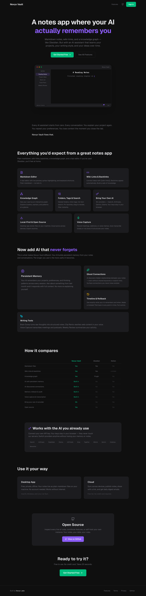

<p align="center">
  
</p>

<h1 align="center">Novyx Vault</h1>

<p align="center">
  <strong>Open-source second brain with AI memory that actually persists.</strong><br>
  <em>Every other AI assistant starts from zero. This one learns.</em>
</p>

<p align="center">
  <a href="https://vault.novyxlabs.com"><strong>Try it free</strong></a> &nbsp;&middot;&nbsp;
  <a href="https://novyxlabs.com">Website</a> &nbsp;&middot;&nbsp;
  <a href="https://discord.gg/jbef3MJy">Discord</a> &nbsp;&middot;&nbsp;
  <a href="CONTRIBUTING.md">Contributing</a> &nbsp;&middot;&nbsp;
  <a href="CHANGELOG.md">Changelog</a>
</p>

<p align="center">
  <a href="https://github.com/novyxlabs/novyx-vault/blob/main/LICENSE"></a>
  <a href="https://github.com/novyxlabs/novyx-vault/actions/workflows/ci.yml"></a>
  <a href="https://github.com/novyxlabs/novyx-vault/stargazers"></a>
</p>

---

## The problem

AI in note-taking apps doesn't remember you. Notion AI, Obsidian plugins, Reflect, Mem — they all do the same thing: search your notes when you ask a question (RAG). Close the tab, start a new session, and the AI starts from zero.

**Novyx Vault is different.** Your AI builds persistent memory from your notes and conversations — memory that survives sessions, consolidates over time, and can be rolled back when it goes wrong. The longer you use it, the smarter it gets.

## What makes it different

| | Novyx Vault | Obsidian | Notion | Reflect |
|---|---|---|---|---|
| **AI remembers across sessions** | Yes — persistent memory | No | No | No |
| **Memory rollback & audit trail** | Built in | No | Page history only | No |
| **AI discovers hidden connections** | Built in (Ghost Connections) | No | No | No |
| **Bring your own AI provider** | 20+ providers | Plugin-dependent | No | 2 models |
| **Open source** | MIT | Source-available | No | No |
| **Local-first / offline** | Yes (Tauri desktop) | Yes | No | No |
| **Markdown files** | Yes | Yes | No | No |
| **Knowledge graph** | Yes | Yes | No | No |

## Quick start

### Use it now (no install)

**[vault.novyxlabs.com](https://vault.novyxlabs.com)** — sign in with GitHub or Google. Free.

### Self-host (3 commands)

```bash
git clone https://github.com/novyxlabs/novyx-vault.git
cd novyx-vault
npm install && npm run dev
```

Open [http://localhost:3000](http://localhost:3000). That's it — notes, wiki-links, knowledge graph, and AI chat all work immediately.

**Add persistent AI memory (optional):**

```bash
echo "NOVYX_MEMORY_API_KEY=your_key" > .env.local
```

Get a free API key at [novyxlabs.com](https://novyxlabs.com) — unlocks cross-session memory, rollback, ghost connections, and cortex insights.

### Docker (one command)

```bash
docker run -p 3000:3000 ghcr.io/novyxlabs/novyx-vault
```

### Desktop app (Tauri)

```bash
npm run tauri:dev    # development with hot reload
npm run tauri:build  # production build
```

Requires [Rust](https://rustup.rs/).

---

## Features

### Persistent AI memory

The core differentiator. Powered by [Novyx Core](https://novyxlabs.com).

- **Cross-session memory** — Your AI remembers projects, preferences, and decisions from every past session. Ask about something from last month and it responds with full context.
- **Ghost Connections** — AI discovers hidden relationships between notes without shared keywords or explicit links.
- **Memory timeline & rollback** — See what your AI learned and when. Roll back to any point in time.
- **Cortex insights** — AI surfaces emerging themes and patterns from your accumulated knowledge.
- **Entity extraction** — People, projects, and concepts extracted into a semantic knowledge graph.
- **Audit trail** — Every memory operation logged with hash-chain verification.

### Notes & editor

- **Markdown editor** — CodeMirror 6 with live preview, syntax highlighting, keyboard shortcuts. Plain `.md` files, no lock-in.
- **Wiki-links & backlinks** — `[[wiki-links]]` with automatic bidirectional backlinks.
- **Knowledge graph** — Interactive force-directed graph of your entire vault.
- **Folders, tags & search** — Nested folders, inline tags, full-text search, pinned favorites.

### AI writing tools

- **Voice capture** — Record and transcribe on-device or via cloud. AI structures transcripts into clean notes.
- **Brain dump** — Paste raw thoughts, get structured notes back.
- **Clip remix** — Paste web content, get it rewritten in your voice.
- **Slash commands** — Inline AI anywhere in the editor.
- **Weekly review** — Automated summary of your writing activity.
- **Writing coach** — AI feedback on clarity, structure, and tone.

### 20+ AI providers (BYOK)

OpenAI, Anthropic, Google Gemini, DeepSeek, Groq, Together, Mistral, xAI Grok, Perplexity, Cohere, Nvidia NIM, Hyperbolic, Cerebras, SambaNova, Fireworks, Moonshot, MiniMax, OpenRouter, Ollama, LM Studio.

Your keys stay in your browser. We never store them on our servers. Switch providers without losing memory or notes.

### Local-first & open source

- **Desktop app** — Native via Tauri (macOS, Windows, Linux). Notes stored as plain markdown in `~/SecondBrain/`. Works offline.
- **Cloud sync** — Optional Supabase-powered cloud with row-level security.
- **MIT licensed** — Inspect, contribute, or self-host.

---

## Importing from Obsidian

Already have an Obsidian vault? Vault imports your notes, preserves wiki-links, and adds persistent AI memory on top.

```
Settings → Import → Obsidian → Select your vault folder
```

---

## MCP integration

The same Novyx memory works across Vault, Claude Code, Cursor, and any MCP-compatible tool.

```bash
pip install novyx-mcp
claude mcp add novyx-memory -- python -m novyx_mcp
```

Memories created in Claude Code appear in Vault. Memories from Vault are available to your coding agent. One API key, one memory, everywhere.

---

## Cloud deployment

Cloud mode adds auth, sync, sharing, and publishing via Supabase.

### Environment variables

| Variable | Required | Description |
|----------|----------|-------------|
| `STORAGE_MODE` | Cloud only | Set to `supabase` for cloud mode |
| `NEXT_PUBLIC_SUPABASE_URL` | Cloud only | Supabase project URL |
| `NEXT_PUBLIC_SUPABASE_ANON_KEY` | Cloud only | Supabase anonymous key |
| `SUPABASE_SERVICE_ROLE_KEY` | Cloud only | Server-side key. **Never expose to client.** |
| `NOVYX_MEMORY_API_KEY` | Desktop | Personal Novyx API key |
| `NOVYX_ADMIN_KEY` | Cloud only | Admin key for per-user provisioning |
| `UPSTASH_REDIS_REST_URL` | Optional | Redis for rate limiting |
| `UPSTASH_REDIS_REST_TOKEN` | Optional | Redis auth token |

### Deploy

```bash
npm run build
```

Or connect to [Vercel](https://vercel.com) for automatic deployments.

---

## Scripts

| Command | Description |
|---------|-------------|
| `npm run dev` | Development server |
| `npm run build` | Production build |
| `npm run start` | Production server |
| `npm run lint` | ESLint |
| `npm run test` | Playwright E2E tests |
| `npm run test:unit` | Vitest unit tests |
| `npm run tauri:dev` | Tauri desktop dev |
| `npm run tauri:build` | Tauri desktop build |

## Tech stack

Next.js 16 &middot; React 19 &middot; TypeScript &middot; Tailwind CSS 4 &middot; CodeMirror 6 &middot; Novyx SDK &middot; Supabase &middot; Tauri v2

**53 components &middot; 65 API routes &middot; 20+ AI providers**

## Project structure

```
app/              Next.js app router (pages + API routes)
components/       React components
lib/              Storage adapters, Novyx client, providers, transcription
public/           Static assets
src-tauri/        Tauri desktop app (Rust)
tests/            Playwright E2E + Vitest unit tests
```

---

## Contributing

Contributions welcome! See [CONTRIBUTING.md](CONTRIBUTING.md).

```bash
git clone https://github.com/novyxlabs/novyx-vault.git
cd novyx-vault
npm install
npm run dev
```

<a href="https://github.com/novyxlabs/novyx-vault/graphs/contributors">
  
</a>

## License

[MIT](LICENSE)

---

<p align="center">
  Built by <a href="https://novyxlabs.com">Novyx Labs</a>
</p>
